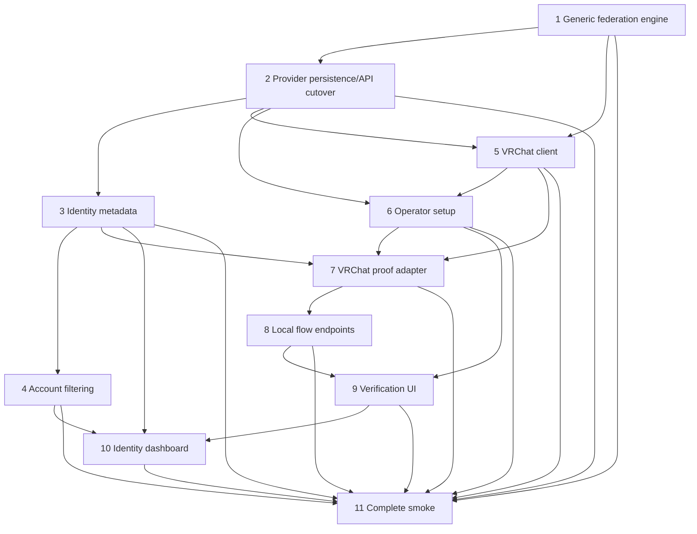

# VRChat Upstream Identity Provider Implementation Plan

> **For agentic workers:** REQUIRED SUB-SKILL: Use superpowers-extended-cc:subagent-driven-development (recommended) or superpowers-extended-cc:executing-plans to implement this plan task-by-task. Steps use checkbox (`- [ ]`) syntax for tracking.

**Goal:** Add VRChat as a native upstream identity provider, prove account ownership through a fresh one-time VRChat profile link, persist bounded provider-specific identity metadata, and make that metadata searchable by administrators.

**Architecture:** Replace the OIDC-owned federation orchestrator with a protocol-neutral `pkg/federation` service and registry. OIDC, Steam, and VRChat become leaf adapters that return one bounded `VerifiedIdentity`. The shared resolver exclusively owns the transactional account/invitation/link/metadata mutation and its resolution audit. After that transaction commits, the service consumes the flow and returns a `CompletionResult`; one server writer owns confirmation grant, session/cookie, redirect, and avatar-delivery effects. VRChat uses an encrypted, reusable operator-account cookie jar for fixed-origin API reads and a browser-bound, explicit profile-link proof flow rather than accepting end-user credentials.

**Tech Stack:** Go 1.26 (`net/http`, pgx v5, sqlc, goose, AES-256-GCM), repository KV/audit/diagnostic services, Vue 3, TypeScript, Vite, Tailwind v4, shadcn-vue/Reka UI, Vitest.

**Specification:** `docs/superpowers/specs/2026-07-14-vrchat-identity-provider-design.md`

**Locked decisions:**
- Full provider plugin refactor; no protocol branches remain in an OIDC-owned orchestrator.
- VRChat authentication never accepts an end user's VRChat password.
- An administrator explicitly accepts VRChat's unofficial API/session risk and configures a dedicated operator verification account.
- Every VRChat login or link requires a fresh one-time bio link.
- VRChat `auto_provision` asks for a local Prohibitorum username only when the identity is unknown; invite redemption keeps the invitation username.
- VRChat verified metadata is exactly `userId`, `displayName`, and `profileUrl`; Steam metadata is backfilled and refreshed.
- Admin account search is server-side and filter-before-pagination; advanced field filters are registry-whitelisted and parameterized.
- Existing configurable IdP icons and the generic accessible provider button are used; no VRChat trademark asset is bundled.

---

## File Structure

### New backend files
- `pkg/federation/types.go` — protocol-neutral providers, actions, flow intents, verified identity, completion result, and adapter contract.
- `pkg/federation/registry.go` — immutable adapter registry and descriptor lookup.
- `pkg/federation/provider_store.go` — `db.UpstreamIdp` to bounded domain-provider projection.
- `pkg/federation/state.go` — generic flow/confirmation state, browser bindings, KV keys, and retry-safe state transitions.
- `pkg/federation/secret.go` — existing-AAD-compatible provider secret sealing plus temporary challenge sealing.
- `pkg/federation/resolver.go` — shared provisioning/linking/invite resolver using `VerifiedIdentity`.
- `pkg/federation/service.go` — adapter dispatch, flow lifecycle, resolver invocation, terminal consumption, and `CompletionResult`.
- `pkg/federation/outbound.go` — existing hardened outbound HTTP policy moved out of OIDC.
- `pkg/federation/avatar.go` — bounded inherited-avatar fetch shared by all adapters.
- Matching `*_test.go` files in `pkg/federation/`.
- `pkg/federation/providers/oidc/adapter.go` — OIDC adapter around moved discovery/token/claims logic.
- `pkg/federation/providers/steam/adapter.go` — Steam adapter around moved OpenID/Web API logic.
- `pkg/federation/providers/vrchat/types.go` — bounded VRChat wire structs and typed HTTP errors.
- `pkg/federation/providers/vrchat/client.go` — fixed-origin API client, User-Agent, caps, timeouts, and 2FA calls.
- `pkg/federation/providers/vrchat/cookies.go` — allowlisted cookie-jar serialization.
- `pkg/federation/providers/vrchat/operator.go` — temporary/persistent operator-session workflow.
- `pkg/federation/providers/vrchat/adapter.go` — local profile-proof state machine and descriptor.
- `pkg/federation/providers/vrchat/proof.go` — VRChat ID/profile parsing and exact proof-link canonicalization.
- Matching `*_test.go` files in `pkg/federation/providers/vrchat/`.
- `pkg/server/handle_admin_vrchat.go` and `_test.go` — sudo-gated operator setup/verify/validate endpoints.
- `pkg/server/handle_federation_flow.go` and `_test.go` — local flow read/prepare/verify endpoints and common post-resolution delivery writer.
- `pkg/server/handle_vrchat_proof.go` and `_test.go` — no-store/no-referrer SPA wrapper for public proof links.
- `db/migrations/031_provider_plugins_and_identity_data.sql` — protocol-neutral provider config/secret health and identity metadata.

### Moved backend files
- `pkg/federation/oidc/{client.go,httpclient.go,federation.go,...}` to `pkg/federation/providers/oidc/`, excluding orchestration/resolver/state/secret code that moves into core.
- `pkg/federation/steam/*` to `pkg/federation/providers/steam/`.

### New dashboard files
- `dashboard/src/pages/FederationFlowView.vue` and `.test.ts` — local VRChat identify/proof/verify ceremony.
- `dashboard/src/pages/VRChatProofView.vue` and `.test.ts` — generic public explanation for proof links.

### Modified persistence/API/backend files
- `db/queries/upstream_idp.sql`, `account_identity.sql`, `account.sql`.
- Regenerated `pkg/db/models.go`, `upstream_idp.sql.go`, `account_identity.sql.go`, `account.sql.go`, and `querier.go` if emitted by sqlc.
- `pkg/contract/auth.go` — discriminated provider view, search descriptors, identity views, matched identity context.
- `pkg/server/server.go`, `handle_federation.go`, `handle_me_identities.go`, `handle_enrollment.go`, `handle_admin_upstream_idps.go`, `handle_account.go`, `pagination.go` and focused tests.
- `pkg/authn/errors.go`, `pkg/weberr/registry.go` and coverage tests for new stable error codes.
- `cmd/prohibitorum/main.go`, `dev_seed.go`, `dev_federation.go` — provider config/secret cutover and moved imports.
- `cmd/smoke/main.go` — mocked VRChat operator and proof ceremony.

### Modified dashboard files
- `dashboard/src/router/index.ts` and router tests.
- `dashboard/src/pages/admin/AdminUpstreamIdpsView.vue` and test — discriminated provider creation including disabled VRChat rows.
- `dashboard/src/pages/admin/AdminUpstreamIdpDetailView.vue` and test — config/health plus inline operator-session wizard.
- `dashboard/src/pages/admin/AdminAccountsView.vue` and test — debounced server search and advanced provider/field filters.
- `dashboard/src/pages/admin/AdminAccountDetailView.vue` and test — read-only linked identity metadata.
- `dashboard/src/pages/ConnectedAccountsView.vue` and test — useful self-service identity labels.
- `dashboard/src/components/custom/FederationButtons.vue` and test — generic VRChat entry.
- `dashboard/src/locales/en.ts`, `zh.ts`, parity/compile tests.

### Deleted files
- Obsolete orchestration/state/resolver/secret files under `pkg/federation/oidc` after every caller is moved.
- Obsolete old-path Steam files after the package move.
- No aliases, re-exports, legacy provider columns, or compatibility handlers remain.

---

### Task 1: Build protocol-neutral federation engine

**Goal:** Move OIDC and Steam behind one protocol-neutral adapter registry without changing their observable login, invite, link, confirmation, session, avatar, or hardened-network behavior.

**Dependencies:** None.

**Files:**
- Create: `pkg/federation/types.go`, `registry.go`, `provider_store.go`, `state.go`, `secret.go`, `resolver.go`, `service.go`, `outbound.go`, `avatar.go` and focused tests.
- Create/move: `pkg/federation/providers/oidc/*`, `pkg/federation/providers/steam/*` and tests.
- Modify: `pkg/server/server.go`, `handle_federation.go`, `handle_me_identities.go`, `handle_enrollment.go`, `handle_federation_confirm.go`, focused tests.
- Modify: `cmd/prohibitorum/main.go`, `cmd/prohibitorum/dev_federation.go`, `cmd/prohibitorum/metadata_fetch_test.go` imports.
- Delete after cutover: obsolete `pkg/federation/oidc/*` and `pkg/federation/steam/*` paths.

**Acceptance Criteria:**
- [ ] `pkg/federation` owns orchestration, resolver, state, confirmation grants, secret AAD, avatar inheritance, and outbound policy.
- [ ] OIDC, Steam, and fake test adapters implement one flow contract; provider definitions independently own admin validation/readiness. Duplicate and unknown protocols fail closed.
- [ ] `VerifiedIdentity` is the sole input to provisioning/linking/invite resolution.
- [ ] Generic flow state binds exact provider ID/slug/protocol, intent, return target, browser digest, optional account/session, enrollment, expiry, and adapter JSON state.
- [ ] OIDC and Steam login/link/invite tests preserve existing redirects, mix-up/PKCE/nonce checks, OpenID verification, confirmation, session issuance, and avatar behavior.
- [ ] Link flows gain the same browser-cookie binding in addition to account/session binding.
- [ ] No server or CLI caller imports the old OIDC orchestrator path.

**Verify:** `go test ./pkg/federation/... ./pkg/server/... ./cmd/prohibitorum/...` then `go build -tags nodynamic ./...` → all pass.

**Steps:**

- [ ] **Step 1: RED — pin the adapter and registry contract**

Create `pkg/federation/registry_test.go` with fake definitions/adapters. Reject duplicate definitions/adapters, an adapter whose definition is missing, empty descriptors, protocol mismatch, and unknown lookups; prove a definition can exist before its matching flow adapter is attached. Add compile-time assertions for OIDC and Steam once their wrappers exist.

Run: `go test ./pkg/federation -run 'TestRegistry' -v`

Expected: FAIL because `Definition`, `Adapter`, `Descriptor`, and `NewRegistry` do not exist.

- [ ] **Step 2: GREEN — define the core domain contract**

Implement these stable shapes in `pkg/federation/types.go`:

```go
package federation

import (
    "context"
    "encoding/json"
    "net/url"
    "time"
)

type Intent string
const (
    IntentLogin  Intent = "login"
    IntentLink   Intent = "link"
    IntentInvite Intent = "invite"
)

type ActionKind string
const (
    ActionRedirect        ActionKind = "redirect"
    ActionCollectIdentity ActionKind = "collect_identity"
    ActionPublishProof    ActionKind = "publish_proof"
)

type SearchOperator string
const (
    SearchExact    SearchOperator = "exact"
    SearchPrefix   SearchOperator = "prefix"
    SearchContains SearchOperator = "contains"
)

type SearchField struct {
    Key       string
    Operators []SearchOperator
}

type Descriptor struct {
    Protocol         string
    SearchFields     []SearchField
    SupportsOperator bool
    RequiresSecret   bool
}

type SealedSecret struct {
    Ciphertext []byte
    Nonce      []byte
    KeyVersion int32
}

type Provider struct {
    ID                int64
    Slug              string
    DisplayName       string
    Protocol          string
    Mode              string
    Config            json.RawMessage
    Secret            *SealedSecret
    SecretStatus      string
    SecretValidatedAt *time.Time
    Disabled          bool
}

type BeginContext struct {
    Intent          Intent
    FlowID          string
    CallbackURL     string
    ReturnTo        string
    LinkAccountID   *int32
    LinkSessionID   string
    EnrollmentToken string
}

type NextAction struct {
    Kind     ActionKind
    URL      string
    Public   map[string]any
}

type ActionInput struct {
    Kind          ActionKind
    Code          string
    Issuer        string
    Params        url.Values
    Identity      string
    LocalUsername string
}

type IdentityKey struct {
    Issuer  string
    Subject string
}

type AdvanceResult struct {
    Next     *NextAction
    Identity *VerifiedIdentity
    // Candidate is adapter-private output used only by core for a pre-proof
    // known-identity lookup; it is never serialized to the browser or flow.
    Candidate *IdentityKey
    // State is the complete replacement adapter-private state. It is required
    // when Next is non-nil and must be nil when Identity is non-nil.
    State json.RawMessage
}

type VerifiedIdentity struct {
    Issuer         string
    Subject        string
    Email          *string
    EmailVerified  bool
    Username       string
    DisplayName    string
    AMR            []string
    AvatarURL      string
    UpstreamData   map[string]string
}

type CompletionResult struct {
    Intent       Intent
    AccountID    int32
    IdentityID   int64
    ProviderID   int64
    ProviderSlug string
    ReturnTo     string
    AMR          []string
    IsNew        bool
    Confirmed    bool
    AvatarURL    string
}

type Definition interface {
    Protocol() string
    Descriptor() Descriptor
    ValidateConfig(json.RawMessage) error
    ValidateSecret([]byte) error
    Ready(Provider) bool
}

type Adapter interface {
    Protocol() string
    Begin(context.Context, Provider, BeginContext) (json.RawMessage, NextAction, error)
    Advance(context.Context, Provider, json.RawMessage, ActionInput) (AdvanceResult, error)
}
```

`registry.go` validates protocol names with `^[a-z][a-z0-9_]{0,31}$`, copies descriptor slices, and exposes `Definition(protocol)`, `Adapter(protocol)`, and `Descriptor(protocol)` without mutable maps leaking to callers. `RegisterDefinition` rejects duplicate protocols. `RegisterAdapter` requires a prior definition with the same protocol and rejects a second adapter; admin/readiness code always uses the registered `Definition`, while flow service lookup additionally requires `Adapter`.
The registry rejects duplicate field keys, empty operator lists, duplicate/unknown operators, and adapter attempts to write the reserved public key `requiresLocalUsername`. Adapter-private state and current-action public JSON are each capped at 4 KiB. `Begin` state/action and every non-terminal `AdvanceResult.State`/`Next` pair replace the prior state/action atomically before the action is returned; terminal identity results carry neither state nor action. OIDC/Steam concrete types implement and register as both definition and adapter during startup; VRChat registers its concrete definition in Task 2 and its flow adapter in Task 7.

Run the registry tests again; expected PASS.

- [ ] **Step 3: RED/GREEN — move state and secret security controls into core**

First adapt the current state/secret tests so they import `prohibitorum/pkg/federation` and assert:
- state keys begin with `federation:flow:` rather than `oidc:`;
- `FlowState` stores the complete current `NextAction` beside adapter JSON; state decode rejects unknown intent/action, missing provider binding, missing expiry, and oversized adapter/public state;
- `ReadFlow` projects that stored action, and advance rejects any `ActionInput.Kind` other than the stored action kind;
- browser digest comparison is constant-time and required for all intents;
- `OpenProviderSecret` decrypts ciphertext produced by the old AAD `upstream_idp:<id>:<version>`;
- a temporary operator challenge uses separate AAD `upstream_idp:<id>:<version>:operator:<challenge>` and cannot be opened as a persisted provider secret.

Run the focused tests and observe the expected failures, then implement `FlowState` with `CurrentAction NextAction`, `FlowKey`, `FlowLockKey`, `ConfirmGrant`, `SecretStore`, `SealProviderSecret`, `OpenProviderSecret`, `SealTemporary`, and `OpenTemporary`. Keep the existing provider AAD byte-for-byte so migrated OIDC/Steam ciphertext remains decryptable without resealing.

- [ ] **Step 4: RED/GREEN — port the resolver to `VerifiedIdentity`**

Move the behavior tests from `pkg/federation/oidc/modes_test.go` to `pkg/federation/resolver_test.go`. Replace OIDC `Tokens` fixtures with `VerifiedIdentity` fixtures and add assertions that resolver outcomes carry identity/provider IDs and AMR. Preserve tests for all three modes, invitation override, known-identity drift, disabled accounts, username collision, identity conflict, explicit linking, and confirmation. The resolver's final identity-exists decision inside its transaction is authoritative: if `auto_provision` became unknown after prepare and no local username was submitted, it returns typed `ErrLocalUsernameRequired` before any mutation; if an identity became known, it ignores the optional submitted username.

Run: `go test ./pkg/federation -run 'TestResolve|TestLink' -v`

Expected RED: resolver accepts the old OIDC token type. Implement the generic resolver with no adapter imports. Do not persist provider metadata yet; Task 2 adds the column and Task 3 starts writing it through the resolver.

- [ ] **Step 5: RED/GREEN — implement a fake-adapter service state machine**

Add service tests for:
- login/link/invite begin storing exact intent/provider/browser/account/session/enrollment bindings and current action;
- redirect actions round-trip unchanged and local actions reload from the persisted public projection;
- callback route slug/protocol mismatch and current-action mismatch rejection;
- link session/account swap rejection;
- a `Candidate` known-identity lookup setting `requiresLocalUsername` exactly for unknown `auto_provision` login and never for invite, known, or link flows;
- a known-at-prepare identity becoming unknown before terminal resolution: the resolver makes no mutation, service preserves adapter state/bindings/expiry, changes only the stored public `requiresLocalUsername` field to `true`, and the next `ReadFlow` exposes the username input;
- non-terminal success replacing state/action without consuming the flow;
- adapter, identity-lookup, and rolled-back resolver failures restoring prior state/action/expiry; `ErrLocalUsernameRequired` restoring the same private state/bindings/expiry with only `requiresLocalUsername=true`; a committed resolver outcome leaving the already-popped terminal flow consumed before delivery, with replay failing even if delivery later fails.
- unknown/disabled/unready providers failing before adapter calls.

Implement `Service.BeginLogin`, `BeginLink`, `BeginInvite`, `AdvanceCallback`, `ReadFlow`, `PrepareFlow`, and `VerifyFlow`. Generate 32-byte base64url flow and browser tokens. Store only the SHA-256 browser digest. Every advance runs under the per-flow `SetNX` lock. Non-terminal prepare reads without deleting and atomically replaces state/action on success. Terminal callback/verify atomically `Pop`s the flow before calling the adapter, retaining the original bytes and absolute expiry in memory; any adapter, candidate-lookup, or rolled-back resolver error restores those exact bytes with only the remaining TTL. If restoration itself fails, return existing `kv_unavailable` and leave the flow consumed rather than risk duplicate resolution. After resolver commit, never restore: return `CompletionResult` populated only from the resolver outcome, verified identity, provider, and bound flow, then let the server delivery writer run. On a non-terminal `Candidate`, core calls the resolver's read-only identity-exists query using provider ID/issuer/subject, writes the reserved `requiresLocalUsername` public field as `intent==login && mode==auto_provision && !exists`, and persists the resulting action. The service, not adapters, owns flow expiry, current-action validation, and the terminal Pop/restore boundary.

The sole mutation-on-restore case is typed `ErrLocalUsernameRequired`: keep adapter-private state and every binding unchanged, set only current action public `requiresLocalUsername=true`, and preserve the original expiry. If that restoration fails, apply the same `kv_unavailable`/consumed rule. The resolver's in-transaction identity decision, not the prepare-time lookup, is authoritative.

- [ ] **Step 6: Move OIDC and Steam into leaf adapters**

Use symbol-aware file moves for current client/protocol tests. `providers/oidc/adapter.go` builds its existing client, returns `ActionRedirect` at begin, and converts verified claims to `VerifiedIdentity` at callback. `providers/steam/adapter.go` returns the existing OpenID redirect and converts the checked SteamID/player summary to:

```go
VerifiedIdentity{
    Issuer:        steam.Issuer,
    Subject:       steamID,
    Username:      "steam_" + steamID,
    DisplayName:   summary.PersonaName,
    AMR:           []string{"steam"},
    AvatarURL:     summary.AvatarURL,
    UpstreamData: map[string]string{
        "steamId":    steamID,
        "personaName": summary.PersonaName,
        "profileUrl": "https://steamcommunity.com/profiles/" + steamID,
        "avatarUrl":  summary.AvatarURL,
    },
}
```

Move the hardened outbound client to `pkg/federation/outbound.go`; update the SAML metadata CLI to import core. Move avatar fetch to core. Delete the old OIDC-owned resolver/state/secret/orchestrator after all references move.

- [ ] **Step 7: Cut server handlers and wiring to the service**

Construct one registry in `server.NewServer`, assign `federationService *federation.Service`, and update login, callback, invite, link, confirmation, and avatar paths. Preserve current public routes. Login/invite/link begin all set `session.FedStateCookie`; the generic state additionally binds authenticated account and session ID for link intent.

Run all federation/server tests, then `go build -tags nodynamic ./...`.

- [ ] **Step 8: Commit**

```bash
git add pkg/federation pkg/server cmd/prohibitorum
git commit -m "refactor(federation): introduce protocol adapter engine"
```

---

### Task 2: Cut over provider persistence and administration

**Goal:** Replace OIDC-specific provider columns/secret naming with validated adapter config JSON and common secret-health fields across migration, sqlc, admin API, CLI, and existing OIDC/Steam dashboard forms.

**Dependencies:** Task 1.

**Files:**
- Create: `db/migrations/031_provider_plugins_and_identity_data.sql`.
- Create: `pkg/federation/providers/vrchat/definition.go`, `definition_test.go`.
- Modify: `db/queries/upstream_idp.sql`, `db/queries/account_identity.sql`.
- Regenerate: relevant `pkg/db/*.go`.
- Modify: `pkg/federation/provider_store.go`, `pkg/contract/auth.go`, `pkg/server/server.go`, `handle_admin_upstream_idps.go` and tests.
- Modify: `pkg/authn/errors.go`, `pkg/weberr/registry.go`, registry tests, `dashboard/src/locales/en.ts`, `zh.ts`, and error locale parity tests.
- Modify: `cmd/prohibitorum/main.go`, `dev_seed.go`, `dev_federation.go`.
- Modify: `dashboard/src/pages/admin/AdminUpstreamIdpsView.vue`, `AdminUpstreamIdpDetailView.vue` and tests for OIDC/Steam API cutover.

**Acceptance Criteria:**
- [ ] Existing OIDC config is backfilled into `provider_config`; existing Steam config becomes `{}`.
- [ ] Existing encrypted secret bytes/nonces/key versions survive under generic names and decrypt with unchanged AAD.
- [ ] `secret_enc`, `secret_nonce`, and `key_version` are all-null or all-non-null; unconfigured VRChat rows use NULL, never sentinel bytes.
- [ ] `secret_status` is one of `unconfigured|configured|valid|invalid`; existing OIDC/Steam rows backfill to `configured`.
- [ ] `provider_config` and `account_identity.upstream_data` are JSON objects with 8 KiB and 4 KiB database caps respectively; identity data has a GIN index.
- [ ] Protocol CHECK accepts exactly `oidc|steam|vrchat`; old OIDC-only columns are dropped.
- [ ] Provider API uses common fields plus `config`, `secretConfigured`, health, readiness, and descriptor search fields; secret material never appears in reads/audit/errors.
- [ ] Protocol and slug remain immutable; VRChat creation forces `disabled=true` and `secret_status=unconfigured`.
- [ ] The concrete VRChat definition validates `{}`, rejects generic secret input, declares operator support and exact search fields, and reports readiness independently of enabled/disabled state: ready means a sealed secret exists and `secret_status=valid`. Generic flow entry additionally rejects disabled providers; no flow method or placeholder exists yet.
- [ ] OIDC/Steam CLI and dashboard CRUD operate against the new shape.

**Verify:** `sqlc generate && go test ./pkg/server/... ./pkg/federation/... ./cmd/prohibitorum/... && (cd dashboard && npm test -- AdminUpstreamIdpsView AdminUpstreamIdpDetailView && npm run build)` → all pass.

**Steps:**

- [ ] **Step 1: Write the migration and inspect it on a disposable database**

Create migration `031` with this Up sequence:

```sql
-- +goose Up
ALTER TABLE upstream_idp
  ADD COLUMN provider_config jsonb NOT NULL DEFAULT '{}'::jsonb,
  ADD COLUMN secret_status text NOT NULL DEFAULT 'configured'
    CHECK (secret_status IN ('unconfigured','configured','valid','invalid')),
  ADD COLUMN secret_validated_at timestamptz;

UPDATE upstream_idp
SET provider_config = CASE protocol
  WHEN 'oidc' THEN jsonb_build_object(
    'issuerUrl', issuer_url,
    'clientId', client_id,
    'scopes', to_jsonb(scopes),
    'allowedDomains', to_jsonb(allowed_domains),
    'usernameClaim', username_claim,
    'displayNameClaim', display_name_claim,
    'emailClaim', email_claim,
    'pictureClaim', picture_claim,
    'requireVerifiedEmail', require_verified_email,
    'allowPrivateNetwork', allow_private_network
  )
  WHEN 'steam' THEN '{}'::jsonb
END;

ALTER TABLE upstream_idp RENAME COLUMN client_secret_enc TO secret_enc;
ALTER TABLE upstream_idp ALTER COLUMN secret_enc DROP NOT NULL;
ALTER TABLE upstream_idp ALTER COLUMN secret_nonce DROP NOT NULL;
ALTER TABLE upstream_idp ALTER COLUMN key_version DROP NOT NULL;
ALTER TABLE upstream_idp
  ADD CONSTRAINT upstream_idp_secret_tuple_check CHECK (
    (secret_enc IS NULL AND secret_nonce IS NULL AND key_version IS NULL)
    OR (secret_enc IS NOT NULL AND secret_nonce IS NOT NULL AND key_version IS NOT NULL)
  ),
  ADD CONSTRAINT upstream_idp_config_object_check CHECK (
    jsonb_typeof(provider_config) = 'object'
    AND octet_length(provider_config::text) <= 8192
  );

ALTER TABLE upstream_idp DROP CONSTRAINT IF EXISTS upstream_idp_protocol_check;
ALTER TABLE upstream_idp ADD CONSTRAINT upstream_idp_protocol_check
  CHECK (protocol IN ('oidc','steam','vrchat'));

ALTER TABLE account_identity
  ADD COLUMN upstream_data jsonb NOT NULL DEFAULT '{}'::jsonb,
  ADD CONSTRAINT account_identity_upstream_data_check CHECK (
    jsonb_typeof(upstream_data) = 'object'
    AND octet_length(upstream_data::text) <= 4096
  );
UPDATE account_identity ai
SET upstream_data = jsonb_build_object('steamId', ai.upstream_sub)
FROM upstream_idp ip
WHERE ip.id = ai.upstream_idp_id AND ip.protocol = 'steam';
CREATE INDEX account_identity_upstream_data_gin_idx
  ON account_identity USING gin (upstream_data jsonb_path_ops);

ALTER TABLE upstream_idp
  DROP COLUMN issuer_url,
  DROP COLUMN client_id,
  DROP COLUMN scopes,
  DROP COLUMN allowed_domains,
  DROP COLUMN username_claim,
  DROP COLUMN display_name_claim,
  DROP COLUMN email_claim,
  DROP COLUMN picture_claim,
  DROP COLUMN require_verified_email,
  DROP COLUMN allow_private_network;
```

The Down migration is explicitly lossy for VRChat rows and returns exactly to the migration-030 schema:

```sql
-- +goose Down
DELETE FROM account_identity
WHERE upstream_idp_id IN (SELECT id FROM upstream_idp WHERE protocol = 'vrchat');
DELETE FROM upstream_idp WHERE protocol = 'vrchat';

ALTER TABLE upstream_idp
  ADD COLUMN issuer_url text NOT NULL DEFAULT '',
  ADD COLUMN client_id text NOT NULL DEFAULT '',
  ADD COLUMN scopes text[] NOT NULL DEFAULT ARRAY['openid','profile','email'],
  ADD COLUMN allowed_domains text[] NOT NULL DEFAULT ARRAY[]::text[],
  ADD COLUMN username_claim text NOT NULL DEFAULT 'preferred_username',
  ADD COLUMN display_name_claim text NOT NULL DEFAULT 'name',
  ADD COLUMN email_claim text NOT NULL DEFAULT 'email',
  ADD COLUMN picture_claim text NOT NULL DEFAULT 'picture',
  ADD COLUMN require_verified_email boolean NOT NULL DEFAULT true,
  ADD COLUMN allow_private_network boolean NOT NULL DEFAULT false;

UPDATE upstream_idp
SET issuer_url = provider_config->>'issuerUrl',
    client_id = provider_config->>'clientId',
    scopes = ARRAY(SELECT jsonb_array_elements_text(provider_config->'scopes')),
    allowed_domains = ARRAY(SELECT jsonb_array_elements_text(provider_config->'allowedDomains')),
    username_claim = provider_config->>'usernameClaim',
    display_name_claim = provider_config->>'displayNameClaim',
    email_claim = provider_config->>'emailClaim',
    picture_claim = provider_config->>'pictureClaim',
    require_verified_email = (provider_config->>'requireVerifiedEmail')::boolean,
    allow_private_network = (provider_config->>'allowPrivateNetwork')::boolean
WHERE protocol = 'oidc';
UPDATE upstream_idp SET scopes = '{}'::text[] WHERE protocol = 'steam';

ALTER TABLE upstream_idp
  ALTER COLUMN issuer_url DROP DEFAULT,
  ALTER COLUMN client_id DROP DEFAULT,
  DROP CONSTRAINT upstream_idp_protocol_check,
  ADD CONSTRAINT upstream_idp_protocol_check CHECK (protocol IN ('oidc','steam')),
  DROP CONSTRAINT upstream_idp_secret_tuple_check,
  ALTER COLUMN secret_enc SET NOT NULL,
  ALTER COLUMN secret_nonce SET NOT NULL,
  ALTER COLUMN key_version SET NOT NULL;
ALTER TABLE upstream_idp RENAME COLUMN secret_enc TO client_secret_enc;

DROP INDEX account_identity_upstream_data_gin_idx;
ALTER TABLE account_identity DROP COLUMN upstream_data;
ALTER TABLE upstream_idp
  DROP COLUMN provider_config,
  DROP COLUMN secret_status,
  DROP COLUMN secret_validated_at;
```

Run migration up/down/up on a disposable database. The Down path intentionally removes VRChat rows because migration 030 cannot represent them; it must still execute cleanly. Query one pre-existing OIDC and Steam fixture before/after; expected config JSON and ciphertext checksums remain stable.

- [ ] **Step 2: Replace provider queries and regenerate sqlc**

`InsertUpstreamIDP` accepts common fields, `provider_config`, nullable secret tuple, and health. `UpdateUpstreamIDPConfig` changes only display name, mode, and validated config; disabled state remains owned by the existing dedicated query/route. Add:

```sql
-- name: UpdateUpstreamIDPSecret :one
UPDATE upstream_idp SET
  secret_enc = $2, secret_nonce = $3, key_version = $4,
  secret_status = $5, secret_validated_at = $6
WHERE slug = $1
RETURNING *;

-- name: UpdateUpstreamIDPHealth :one
UPDATE upstream_idp SET secret_status = $2, secret_validated_at = $3
WHERE slug = $1
RETURNING *;
```

Run `sqlc generate`. Expected: removed OIDC columns disappear from `db.UpstreamIdp`; config/data are `[]byte`; secret tuple key version becomes nullable `pgtype.Int4`.

- [ ] **Step 3: RED/GREEN — validate adapter-owned config at every write boundary**

Update definition/handler tests first. Table-drive OIDC valid/invalid config, Steam non-empty config rejection, VRChat non-empty config rejection, unknown protocol, immutable slug/protocol, oversize config, missing OIDC/Steam secret, VRChat generic-secret rejection, VRChat readiness, and secret-free response/audit bodies. Register the concrete VRChat definition in server construction; admin handlers resolve `Definition`, never `Adapter`.

Use this wire shape:

```go
type providerWriteBody struct {
    Slug        string          `json:"slug,omitempty"`
    DisplayName string          `json:"displayName"`
    Protocol    string          `json:"protocol,omitempty"`
    Mode        string          `json:"mode"`
    Config      json.RawMessage `json:"config"`
    Secret      string          `json:"secret,omitempty"`
}

type IdentitySearchFieldView struct {
    Key       string   `json:"key"`
    Operators []string `json:"operators"`
}
```

OIDC config is exactly:

```json
{
  "issuerUrl": "https://issuer.example",
  "clientId": "client-id",
  "scopes": ["openid", "profile", "email"],
  "allowedDomains": [],
  "usernameClaim": "preferred_username",
  "displayNameClaim": "name",
  "emailClaim": "email",
  "pictureClaim": "picture",
  "requireVerifiedEmail": true,
  "allowPrivateNetwork": false
}
```

Steam and VRChat config are exactly `{}`. Search descriptors are exact: OIDC `subject=[exact]`, `email=[exact,prefix,contains]`; Steam `steamId=[exact]`, `personaName=[exact,prefix,contains]`; VRChat `userId=[exact]`, `displayName=[exact,prefix,contains]`. Operator order is preserved in admin responses and controls.

`IdentityProviderView` returns common fields, raw validated config, `secretConfigured`, `secretStatus`, nullable `secretValidatedAt`, `ready`, and descriptor `searchFields`. It never returns encrypted fields or plaintext secret input.

Retain `POST /api/prohibitorum/identity-providers/set-disabled` with exact body `{"slug":"<slug>","disabled":<bool>}` and HTTP 200 `IdentityProviderView`. Disabling is always allowed. Enabling first loads the registered definition and rejects `Ready(provider)==false` with `provider_not_ready` 503 without updating the row; this is the only enable/disable write path.
Register `provider_not_ready` (503, diagnostic category `federation`) in `authn`/`weberr` and both dashboard locales in this task; Tasks 6–8 reuse the same definition.

- [ ] **Step 4: Update provider store, CLI, dev wiring, and existing dashboard forms**

Decode config once in the adapter, not in generic handlers. CLI flags remain human-readable, serialize OIDC flags into the same JSON config, and send generic secret bytes to the shared sealer. Steam config is `{}`. Update dashboard OIDC/Steam forms to read/write `config` and send `secret`; remove assumptions that every non-Steam provider is OIDC.

Run focused Go/Vitest tests and the dashboard build.

- [ ] **Step 5: Commit**

```bash
git add db pkg/db pkg/federation pkg/contract pkg/server pkg/authn pkg/weberr cmd/prohibitorum dashboard/src
git commit -m "refactor(federation): store adapter-owned provider configuration"
```

---

### Task 3: Persist verified provider identity metadata

**Goal:** Persist bounded adapter-approved metadata on every successful proof, refresh it transactionally on reauthentication, and expose safe read-only identity views.

**Dependencies:** Task 2.

**Files:**
- Modify: `db/queries/account_identity.sql` and generated `pkg/db/account_identity.sql.go`.
- Modify: `pkg/federation/resolver.go`, `providers/steam/adapter.go`, `providers/oidc/adapter.go` and tests.
- Modify: `pkg/contract/auth.go`, `pkg/server/handle_me_identities.go`, `handle_account.go`, `server.go` and tests.

**Acceptance Criteria:**
- [ ] Metadata is always a JSON object containing only adapter-produced strings, at most 16 keys, 128-byte keys, 1 KiB values, and a conservative 4 KiB budget measured by `len(json.MarshalIndent(data, "", " "))`.
- [ ] New, invited, and explicitly linked identities insert metadata in the same transaction as account/link creation.
- [ ] Known identities refresh email and metadata in the same transaction; any resolver/database failure rolls back both.
- [ ] OIDC metadata remains `{}`; migration-backfilled Steam rows contain `steamId`, while every later successful Steam verification replaces metadata with `steamId`, `personaName`, `profileUrl`, and `avatarUrl`.
- [ ] Admin identity views include provider protocol, subject, email, metadata, and linked time; self-service views include useful identity labels/metadata but no provider secret/health.
- [ ] Admins cannot write `upstream_data` through account update APIs.

**Verify:** `go test ./pkg/federation/... ./pkg/server/... -run 'Identity|Resolve|Steam' -v` → all pass.

**Steps:**

- [ ] **Step 1: RED — add resolver metadata contracts**

Extend resolver tests for insert, known-identity refresh, invite, explicit link, oversize data rejection before queries, and rollback on update failure. Assert the encoded object exactly, not by source-text inspection.

Run focused tests; expected FAIL because query params and views have no metadata.

- [ ] **Step 2: GREEN — add transactional identity queries**

Change insert and refresh queries to:

```sql
-- name: InsertAccountIdentity :one
INSERT INTO account_identity (
  account_id, upstream_idp_id, upstream_iss, upstream_sub, upstream_email, upstream_data
) VALUES ($1, $2, $3, $4, $5, $6)
RETURNING *;

-- name: UpdateAccountIdentityVerifiedData :exec
UPDATE account_identity
SET upstream_email = $2, upstream_data = $3
WHERE id = $1;
```

Add `ValidateUpstreamData(map[string]string) ([]byte, error)` in core and call it before opening resolver transactions. It enforces the key/value limits, computes the 4096-byte budget with `json.MarshalIndent(data, "", " ")`, then returns compact `json.Marshal(data)` bytes for sqlc. For a string-only object, PostgreSQL `jsonb::text` is no longer than this indented representation; database boundary tests assert accepted maximum fixtures satisfy the CHECK and the next byte is rejected before a query. Never merge arbitrary old keys: the latest verified adapter object replaces the prior object.

- [ ] **Step 3: Extend admin and self-service identity reads**

Add `contract.AccountIdentityView`:

```go
type AccountIdentityView struct {
    ID                  int64             `json:"id"`
    ProviderSlug        string            `json:"providerSlug"`
    ProviderDisplayName string            `json:"providerDisplayName"`
    Protocol            string            `json:"protocol"`
    Subject             string            `json:"subject"`
    Email               *string           `json:"email,omitempty"`
    Data                map[string]string `json:"data"`
    LinkedAt            time.Time         `json:"linkedAt"`
}
```

Every account-list row has the same safe projection field; it is `[]` without an active identity search/filter and otherwise contains only explanatory identities:

```go
MatchingIdentities []AccountIdentityView `json:"matchingIdentities"`
```

The SQL aggregate uses exactly `id`, `providerSlug`, `providerDisplayName`, `protocol`, `subject`, nullable `email`, `data`, and `linkedAt`, matching `AccountIdentityView`; it never returns encrypted provider fields.

Extend `ListAccountIdentitiesByAccount` to select provider protocol. Add admin `GET /accounts/{id}/identities`; use the same safe projection for `/me/identities` while retaining self-service unlink IDs. Disabled providers still display existing links. If a stored metadata value is non-string or the object cannot decode, return HTTP 200 with that identity's `data:{}`, emit structured error log event `identity_metadata_invalid` containing only identity ID and provider ID (never raw JSON), and continue projecting the remaining identities; capture that exact behavior in handler tests.

- [ ] **Step 4: Commit**

```bash
git add db/queries pkg/db pkg/federation pkg/contract pkg/server
git commit -m "feat(federation): persist verified identity metadata"
```

---

### Task 4: Add server-side account identity filtering

**Goal:** Filter the complete account directory before keyset pagination using unified search and registry-approved provider fields, and return the identity context that matched each row.

**Dependencies:** Task 3.

**Files:**
- Modify: `db/queries/account.sql`, generated `pkg/db/account.sql.go`.
- Modify: `pkg/contract/auth.go`, `pkg/server/handle_account.go`, `pagination.go` and tests.

**Acceptance Criteria:**
- [ ] `GET /accounts` accepts `q`, `provider`, `field`, `value`, `match`, `limit`, and `cursor`.
- [ ] `q` searches local username/display name/email, upstream subject/email, and fixed approved metadata keys case-insensitively.
- [ ] `provider` alone selects accounts with any identity for that exact provider slug and returns all of those provider identities in `matchingIdentities`.
- [ ] A field filter requires non-empty `provider`, `field`, `value`, and `match`; stray partial parameters are `400`, and only descriptor-declared operators are accepted.
- [ ] Predicate composition is exact: `(q empty OR local q match OR any identity q match) AND (provider empty OR any identity matches provider plus its optional field predicate)`. The q-match and provider-match may be different identities on the same account.
- [ ] SQL uses fixed CASE expressions and bound parameters; field names/operators never become SQL or JSONPath text.
- [ ] Filters apply before `(created_at,id)` pagination and are normalized into cursor bindings; changing any filter invalidates an old cursor.
- [ ] Empty/no-match pages and later-page matches behave correctly.

**Verify:** `sqlc generate && go test ./pkg/server/... -run 'ListAccounts|AccountFilter|Cursor' -v` → all pass.

**Steps:**

- [ ] **Step 1: RED — specify HTTP validation and cursor behavior**

Add handler tests for local `q`, upstream subject/email, Steam persona, VRChat display name, provider-only, exact/prefix/contains, unsupported provider/field/operator, partial advanced parameters, cursor reuse after a filter change, combined q/provider matches on the same and different identities, unfiltered `matchingIdentities: []`, and matching identities in the response. The fake query must record the generated `db.ListAccountsParams` so tests prove validation happens before the database call.

- [ ] **Step 2: GREEN — add fixed, parameterized SQL predicates**

Use a fixed field expression, duplicated in the row predicate and matched-identity aggregate:

```sql
CASE sqlc.narg('field')::text
  WHEN 'subject'    THEN ai.upstream_sub
  WHEN 'email'      THEN COALESCE(ai.upstream_email, '')
  WHEN 'steamId'    THEN ai.upstream_sub
  WHEN 'personaName' THEN COALESCE(ai.upstream_data->>'personaName', '')
  WHEN 'userId'     THEN ai.upstream_sub
  WHEN 'displayName' THEN COALESCE(ai.upstream_data->>'displayName', '')
  ELSE ''
END
```

Define the CASE expression above as `selected.field_value` through a `CROSS JOIN LATERAL` inside each identity `EXISTS`/aggregate. The operator predicate is fixed and uses the GIN index for exact metadata matches:

```sql
CASE
  WHEN sqlc.narg('match')::text = 'exact'
   AND sqlc.narg('field')::text IN ('personaName', 'displayName')
    THEN ai.upstream_data @> jsonb_build_object(
      sqlc.narg('field')::text,
      to_jsonb(sqlc.narg('value')::text)
    )
  WHEN sqlc.narg('match')::text = 'exact'
    THEN lower(selected.field_value) = lower(sqlc.narg('value')::text)
  WHEN sqlc.narg('match')::text = 'prefix'
    THEN lower(selected.field_value) LIKE lower(sqlc.narg('value')::text) || '%'
  WHEN sqlc.narg('match')::text = 'contains'
    THEN lower(selected.field_value) LIKE '%' || lower(sqlc.narg('value')::text) || '%'
  ELSE false
END
```

Unified search uses bound `ILIKE '%' || q || '%'` across local columns, identity columns, and the fixed `personaName`, `displayName`, and `profileUrl` metadata keys. The account predicate uses the exact two-`EXISTS` composition above. Aggregate the exact `AccountIdentityView` members above with `jsonb_agg(jsonb_build_object(...))`: include the union of identities satisfying the active q identity predicate and identities satisfying the active provider/field predicate. A local-only q match returns `[]`; no filters returns `[]`.

- [ ] **Step 3: Bind normalized filters into pagination**

Add the five query fields to `listAccountsIn`. Trim `q`, `value`, and `field`; lowercase only provider slug and match operator; preserve the descriptor's case-sensitive field key. Omit empty defaults and pass the exact normalized map to `decodeCursor`/`encodeNextCursor`. Load the selected provider row, then validate the field/operator against `s.federationService.Registry().Descriptor(provider.Protocol)` before calling sqlc.

- [ ] **Step 4: Commit**

```bash
git add db/queries/account.sql pkg/db pkg/contract pkg/server
git commit -m "feat(admin): filter accounts by verified upstream identity"
```

---

### Task 5: Implement bounded VRChat API client

**Goal:** Implement the fixed-origin VRChat authentication/public-user client with strict User-Agent, cookie, redirect, timeout, response-size, status, and 2FA handling.

**Dependencies:** Tasks 1 and 2.

**Files:**
- Create: `pkg/federation/providers/vrchat/types.go`, `client.go`, `cookies.go`, `origin_default.go`, `origin_smoke.go`, `client_test.go`, `cookies_test.go`.

**Acceptance Criteria:**
- [ ] Production origin is fixed to `https://api.vrchat.cloud/api/1`; user/admin input cannot alter it.
- [ ] Every request sends `User-Agent: Prohibitorum/<build-version> <public-origin>`; `(devel)` normalizes to `dev`.
- [ ] Login Basic auth uses `base64(url.QueryEscape(username)+":"+url.QueryEscape(password))` and is never logged/returned.
- [ ] Redirects are refused; total timeout is 10 seconds; current-user and public-user response bodies are each capped at 1 MiB before decode, and 2FA verification responses are capped at 4 KiB.
- [ ] Accept only `auth` and `twoFactorAuth` response cookies with `Secure`, `HttpOnly`, `Path=/`, and either no Domain attribute (host-only) or the exact case-insensitive domain `api.vrchat.cloud`; reject every other name/scope and persist no Domain value.
- [ ] TOTP (`totp`) posts `{"code":"..."}` to `/auth/twofactorauth/totp/verify`; email OTP (`emailOtp`) posts it to `/auth/twofactorauth/emailotp/verify`; recovery code (`otp`) posts it to `/auth/twofactorauth/otp/verify`. Codes are at most 256 bytes, JSON request bodies at most 4 KiB, and every response must contain `verified:true`.
- [ ] `401/403`, `429` with parsed `Retry-After`, 5xx, malformed JSON, oversized bodies, wrong IDs, missing fields, and failed verification results are typed without raw body/header leakage.

**Verify:** `go test ./pkg/federation/providers/vrchat -run 'TestClient|TestCookie|TestDefaultOrigin' -v && go test -tags smoke ./pkg/federation/providers/vrchat -run TestSmokeOrigin -v` → both pass.

**Steps:**

- [ ] **Step 1: RED — write httptest-backed client contracts**

Package tests inject an unexported base URL/transport seam. Normal builds compile `origin_default.go` (`//go:build !smoke`), whose resolver always returns the production constant and reads no override. Smoke builds compile `origin_smoke.go` (`//go:build smoke`), which requires `PROHIBITORUM_VRCHAT_SMOKE_ORIGIN` to be loopback HTTPS with no userinfo/query/fragment and exact `/api/1` path and loads the sole trusted root from `PROHIBITORUM_VRCHAT_SMOKE_CA_FILE`; invalid/missing origin or CA fails client construction. `TestSmokeOrigin` generates a temporary CA/server certificate, sets both variables per subtest, and covers missing/invalid values plus a trusted request. Cover authorization encoding, required User-Agent on every path, no redirect follow, body caps, 2FA method parsing, the three exact verify paths/bodies, cookie allowlist, `Retry-After` seconds/date, redacted errors, and both origin resolvers. Observe the failures before implementation.

- [ ] **Step 2: GREEN — implement bounded wire types and client**

Use only consumed fields:

```go
type currentUserWire struct {
    ID                    *string         `json:"id"`
    DisplayName           *string         `json:"displayName"`
    RequiresTwoFactorAuth json.RawMessage `json:"requiresTwoFactorAuth"`
}

type publicUserWire struct {
    ID                             *string         `json:"id"`
    DisplayName                    *string         `json:"displayName"`
    BioLinks                       json.RawMessage `json:"bioLinks"`
    CurrentAvatarThumbnailImageURL *string         `json:"currentAvatarThumbnailImageUrl"`
}

type CurrentUser struct {
    ID                    string
    DisplayName           string
    RequiresTwoFactorAuth []string
}

type PublicUser struct {
    ID                             string
    DisplayName                    string
    BioLinks                       []string
    CurrentAvatarThumbnailImageURL string
}

type verifyResultWire struct {
    Verified *bool `json:"verified"`
}

type HTTPError struct {
    Status     int
    RetryAfter time.Duration
    Category   string
}
```

`HTTPError.Error()` returns only category/status. Decode through `io.LimitReader(max+1)` and reject `max+1`. Current-user decoding is an explicit union: authenticated success requires non-empty `id` and `displayName` and allows `requiresTwoFactorAuth` to be absent, null, or an empty array; a challenge requires both user fields absent and a present, non-null, non-empty method array. Reject partial user fields, a non-empty challenge mixed with user fields, missing/null/empty methods when user fields are absent, non-string methods, and unknown-only method sets rather than guessing an endpoint. Public-user decoding requires present non-empty `id`, `displayName`, and `currentAvatarThumbnailImageUrl`, plus a present non-null string-array `bioLinks`; an empty link array is valid and means proof missing. Enforce exact `usr_<uuid>` IDs, display names of 1–256 bytes, at most 16 bio links of at most 2 KiB each, avatar URLs of at most 4 KiB, and at most three 2FA methods. Missing/invalid fields return typed `malformed_response`.
Limit methods to wire values `totp`, `emailOtp`, and `otp`; the dashboard labels `otp` as a recovery code without renaming the API value. Each verification call sets `Content-Type: application/json`, sends only the `code` property, and requires a present `verified:true` from the bounded `verifyResultWire`; false, null, or missing is a typed verification failure. Unknown response properties are ignored.

- [ ] **Step 3: GREEN — serialize the cookie jar minimally**

Persist a JSON array containing only name, value, path, expires, secure, HTTP-only, and SameSite. Validate scope on each `Set-Cookie` before persistence, omit Domain from the envelope, and rehydrate only onto the resolved origin (the production constant in every non-smoke build). Reject duplicate names, expired cookies, unexpected names/domains/paths, non-secure or non-HTTP-only cookies, and encoded payloads above 16 KiB.

- [ ] **Step 4: Commit**

```bash
git add pkg/federation/providers/vrchat
git commit -m "feat(vrchat): add bounded API client"
```

---

### Task 6: Add operator session setup workflow

**Goal:** Let a sudo-authenticated administrator establish, complete, validate, and renew the dedicated encrypted VRChat operator session without persisting credentials or OTPs.

**Dependencies:** Tasks 2 and 5.

**Files:**
- Create: `pkg/federation/providers/vrchat/operator.go`, `operator_test.go`.
- Create: `pkg/server/handle_admin_vrchat.go`, `handle_admin_vrchat_test.go`.
- Modify: `db/queries/upstream_idp.sql` and generated file if health queries need refinement.
- Modify: `pkg/server/server.go`, `handle_admin_upstream_idps.go`, `pkg/authn/errors.go`, `pkg/weberr/registry.go` and tests.
- Modify: `dashboard/src/pages/admin/AdminUpstreamIdpsView.vue`, `AdminUpstreamIdpDetailView.vue`, tests, `en.ts`, `zh.ts`.

**Acceptance Criteria:**
- [ ] VRChat provider creation is disabled/unconfigured and routes the admin to its detail page.
- [ ] Sudo-gated start accepts operator username/password only in request memory, calls current-user once, and either persists a valid session or returns an opaque temporary challenge plus supported methods.
- [ ] Temporary cookie state is DEK-sealed in KV with provider/challenge AAD and a 10-minute expiry.
- [ ] Verify accepts exactly one challenge/method/code, keeps a challenge retryable after a wrong code, and persists only the final allowlisted cookie envelope after success.
- [ ] Validate uses cookie-only current-user auth, persists refreshed cookies, marks `valid` with timestamp, or marks `invalid` on 401/403.
- [ ] Enabling an unready/invalid VRChat provider is rejected server-side.
- [ ] Audit details contain provider slug, action, method, and failure category only; credentials, codes, cookies, auth headers, challenge payloads, and raw responses never appear.
- [ ] The dashboard wizard is inline/progressive, keyboard-completable, uses existing components, clearly states unofficial API/session risk, and exposes valid/invalid/unconfigured state with text plus badge.

**Verify:** `go test ./pkg/federation/providers/vrchat ./pkg/server -run 'Operator|VRChatProvider' -v && (cd dashboard && npm test -- AdminUpstreamIdp && npm run build)` → all pass.

**Steps:**

- [ ] **Step 1: RED — operator service and route tests**

Write tests for no-2FA success, TOTP/email/recovery challenge, wrong-code retry, challenge provider swap, expiry, replay, concurrent verify lock, cookie encryption/AAD mismatch, validation refresh, 401 invalidation, 429/5xx classification, sudo gate, body cap, readiness gate, and audit redaction. Run and observe failures.

- [ ] **Step 2: GREEN — implement operator service**

Use these response contracts:

```go
type OperatorSessionResult struct {
    Status    string                         `json:"status"` // "challenge" or "valid"
    Challenge string                         `json:"challenge,omitempty"`
    Methods   []string                       `json:"methods,omitempty"`
    ExpiresAt *time.Time                     `json:"expiresAt,omitempty"`
    Provider  *contract.IdentityProviderView `json:"provider,omitempty"`
}

type operatorStartBody struct {
    Username string `json:"username"`
    Password string `json:"password"`
}

type operatorVerifyBody struct {
    Challenge string `json:"challenge"`
    Method    string `json:"method"`
    Code      string `json:"code"`
}
```

Routes:
- `POST /api/prohibitorum/identity-providers/{slug}/operator-session/start`
- `POST /api/prohibitorum/identity-providers/{slug}/operator-session/verify`
- `POST /api/prohibitorum/identity-providers/{slug}/operator-session/validate`

All use the existing sudo wrapper and admin policy. Never echo request fields.
All successful responses are HTTP 200 `OperatorSessionResult`. Start returns either `challenge` with challenge/methods/expiry and no provider, or `valid` with the refreshed provider view. Verify and validate return `valid` with the refreshed provider view and no challenge fields. Errors use the stable codes below and never return partial provider state.

Audit event names are fixed: `vrchat_operator_setup_started`, `vrchat_operator_challenge_issued`, `vrchat_operator_session_validated`, and `vrchat_operator_session_invalidated`. Failure details use only `category`; challenge events include only the non-secret method names returned by VRChat.

- [ ] **Step 3: RED/GREEN — build the inline admin wizard**

Add VRChat to the create protocol selector. For VRChat, show the policy warning and no secret/config controls; after create, navigate to detail. On detail, replace the rotate-secret area with:
1. status badge and last validation time;
2. username/password fields and **Start operator session**;
3. when challenged, method selector, `autocomplete="one-time-code"` code input, and **Verify code**;
4. when configured, **Validate operator session** and **Replace operator session**.

Use a single flat card with progressive sections, not nested cards or a modal. Keep body copy under 75ch, visible focus, and status `aria-live="polite"`. Add English and Chinese keys in parallel and run locale parity tests.

- [ ] **Step 4: Commit**

```bash
git add pkg/federation/providers/vrchat pkg/server pkg/authn pkg/weberr db/queries pkg/db dashboard/src
git commit -m "feat(vrchat): add encrypted operator session setup"
```

---

### Task 7: Implement VRChat profile proof adapter

**Goal:** Implement the VRChat adapter state machine that accepts a stable user ID/profile URL, issues one fresh proof link, verifies the exact returned profile/link, and emits bounded `VerifiedIdentity` data.

**Dependencies:** Tasks 3, 5, and 6.

**Files:**
- Create: `pkg/federation/providers/vrchat/adapter.go`, `proof.go`, `adapter_test.go`, `proof_test.go`.
- Modify: `pkg/federation/service.go`, `resolver.go` and tests for retry/username semantics.
- Modify: `pkg/server/server.go` registry construction.

**Acceptance Criteria:**
- [ ] The VRChat flow adapter reports protocol `vrchat` and attaches only to the existing concrete definition; core continues to source readiness and descriptor data from that definition (`SupportsOperator`, `userId=[exact]`, `displayName=[exact,prefix,contains]`).
- [ ] Input accepts only canonical `usr_<uuid>` or `https://vrchat.com/home/user/usr_<uuid>`; query/fragment/userinfo/other host/scheme/path fail locally.
- [ ] Prepare generates a 32-byte one-time token and exact same-origin `/verify/vrchat/<token>` URL; state remains browser/provider/intent bound.
- [ ] Verify decrypts a valid operator jar, honors provider backoff, calls only fixed `GET /users/{id}`, and requires returned ID exact match.
- [ ] A bio link matches only after canonical scheme, effective host/port, decoded path/token comparison and only with no userinfo/query/fragment.
- [ ] A proof lookup `401/403` marks the provider `invalid`, emits `vrchat_operator_session_invalidated`, returns `provider_not_ready`, and never falls back to end-user credentials.
- [ ] Success emits issuer `https://api.vrchat.cloud/api/1`, subject/userId, display name, canonical profile URL, avatar thumbnail, AMR `vrchat_profile`, and exactly the three approved metadata fields.
- [ ] `auto_provision` requires a valid local username only for an unknown identity; invite ignores it; known/link flows do not rename accounts. If a known identity becomes unknown between prepare and verify, no resolver mutation occurs, the proof state survives, and the flow reloads with `requiresLocalUsername=true`.
- [ ] Missing link, temporary upstream failure, rolled-back resolver failure, username collision, and every other pre-commit failure restore the exact popped flow until its original expiry; the known-to-unknown race changes only `requiresLocalUsername` to true. A failed restore returns `kv_unavailable` and does not reinsert state. Non-terminal prepare replaces state/action. Resolver commit is terminal: the flow remains consumed before server delivery, so replay fails even if delivery returns 500.
- [ ] 429 stores a shared per-provider backoff deadline and returns accurate retry timing without extending ordinary flow expiry.

**Verify:** `go test ./pkg/federation/providers/vrchat ./pkg/federation -run 'VRChat|Proof|RetryableFlow' -v` → all pass.

**Steps:**

Audit event names are fixed: `vrchat_proof_prepared`, `vrchat_proof_verified`, and `vrchat_proof_failed`. Details contain provider slug, intent, and an allowlisted failure category only.

- [ ] **Step 1: RED — prove parser and canonical link rules**

Table-drive valid ID/profile URL, uppercase/malformed UUID, host suffix, port, userinfo, escaped slash, double encoding, query, fragment, trailing slash, wrong public origin, default/effective port equivalence, returned-user mismatch, and exact proof token. Observe the expected failures.

- [ ] **Step 2: GREEN — implement the adapter state**

Use bounded private state only:

```go
type state struct {
    Step       string `json:"step"` // "identify" or "proof"
    UserID     string `json:"user_id,omitempty"`
    ProofToken string `json:"proof_token,omitempty"`
}
```

`Begin` returns `ActionCollectIdentity`. `Advance(ActionCollectIdentity)` parses identity, creates the proof token, and returns updated state, `ActionPublishProof` with only `proofUrl` and canonical `profileUrl`, plus private `Candidate{Issuer, Subject}`. Core performs the identity-exists lookup and adds `requiresLocalUsername` under the rule in Task 1 before atomically persisting the action. `Advance(ActionPublishProof)` performs the public-user proof and returns `VerifiedIdentity`.

- [ ] **Step 3: RED/GREEN — add retry-safe resolution and backoff**

Service tests run two concurrent verifies and assert one adapter call; prepare replaces but does not consume state; terminal verify Pops first; missing-link and rolled-back resolver failures restore byte-equivalent state with the original absolute expiry; failed restoration returns `kv_unavailable` without reinsertion; resolver commit returns the exact `CompletionResult` and never restores; an expired flow is never recreated. Provider backoff key is `federation:provider:<id>:backoff`; store an RFC3339Nano deadline bounded to 15 minutes.

Also simulate a known-at-prepare identity removed before verify: expect no resolver mutation and a restored flow whose private proof state, bindings, and expiry are unchanged while only public `requiresLocalUsername` becomes true.

- [ ] **Step 4: Register VRChat and commit**

```bash
git add pkg/federation pkg/server
git commit -m "feat(vrchat): verify fresh profile-link ownership proofs"
```

---

### Task 8: Expose local federation flow endpoints

**Goal:** Expose the browser-bound local flow read/prepare/verify API, reuse the existing confirmation/session completion path, and serve a non-oracular public proof explanation route.

**Dependencies:** Task 7.

**Files:**
- Create: `pkg/server/handle_federation_flow.go`, `handle_federation_flow_test.go`, `handle_vrchat_proof.go`, `handle_vrchat_proof_test.go`.
- Modify: `pkg/server/handle_federation.go`, `handle_me_identities.go`, `handle_enrollment.go`, `server.go`, `pkg/contract/auth.go` and tests.
- Modify: `pkg/authn/errors.go`, `pkg/weberr/registry.go` and tests, `dashboard/src/locales/en.ts`, `zh.ts`, and locale parity tests.

**Acceptance Criteria:**
- [ ] VRChat login/invite/link begin redirects to `/federation/flow/<opaque-flow>`; OIDC/Steam remain external.
- [ ] `GET /auth/federation/flows/{flow}` projects only provider, intent, step, stored proof instructions/data, stored username requirement, and expiry after binding checks.
- [ ] `POST .../{flow}/prepare` accepts `{identity}` only when stored `CurrentAction.Kind` is `collect_identity`.
- [ ] `POST .../{flow}/verify` accepts optional `{localUsername}` only when stored `CurrentAction.Kind` is `publish_proof`.
- [ ] Clients cannot select provider/protocol/intent/action through body fields; neither handler reconstructs an action from protocol-specific state.
- [ ] Successful login returns `{redirect}` while setting the same confirmation/session cookies as callback flows; successful link returns `/connected` and never mints a session.
- [ ] Expiry, browser swap, link session/account swap, action skipping, replay, malformed/oversized body, provider unready, 429, username conflict, and identity conflict map to stable errors.
- [ ] Resolver rollback leaves the flow retryable; resolver commit consumes it before session/confirmation delivery. A later delivery failure returns 500 and the same flow cannot replay, while a fresh sign-in observes the already-committed account/link/invitation result.
- [ ] `/verify/vrchat/{proof}` always serves the same SPA explanation with `Cache-Control: no-store` and `Referrer-Policy: no-referrer`, without checking whether the proof exists.

**Verify:** `go test ./pkg/server -run 'FederationFlow|VRChatProof|FederationCompletion' -v` → all pass.

**Steps:**

- [ ] **Step 1: RED — route/action/binding tests**

Register a fake local adapter and exercise every route through `httptest`. Assert body fields cannot skip identify; a fixture whose stored provider ID/slug/protocol is tampered to disagree fails before adapter invocation; link requires the initiating session; login requires the browser cookie; completion sets/clears the same cookies as callback; and proof page bytes/status/headers are identical for random/live/expired-looking tokens.

- [ ] **Step 2: GREEN — add exact wire views and raw handlers**

Use:

```go
type federationFlowView struct {
    Provider struct {
        Slug        string `json:"slug"`
        DisplayName string `json:"displayName"`
        Protocol    string `json:"protocol"`
    } `json:"provider"`
    Intent                string     `json:"intent"`
    Step                  string     `json:"step"`
    ProfileURL            string     `json:"profileUrl,omitempty"`
    ProofURL              string     `json:"proofUrl,omitempty"`
    RequiresLocalUsername bool       `json:"requiresLocalUsername"`
    ExpiresAt             time.Time  `json:"expiresAt"`
}

type federationFlowPrepareBody struct { Identity string `json:"identity"` }
type federationFlowVerifyBody struct { LocalUsername string `json:"localUsername,omitempty"` }
```

`Step` has only `identify` and `proof`, mapped by core from stored action kinds `collect_identity` and `publish_proof`; handlers never read adapter-private state. Bound browser/session checks precede every response. GET and successful prepare return HTTP 200 `federationFlowView`, with prepare returning the newly persisted proof view. Successful verify returns HTTP 200 `contract.LoginResult` (`{"redirect":"..."}`) and the completion cookies.

Set `Cache-Control: no-store` on every flow response. For 429, set `Retry-After` from the typed error. Body caps use the repository raw-handler wrapper.

Reuse the Task 2 `provider_not_ready` definition. Register these remaining exact error definitions in `authn`/`weberr` and English/Chinese locales:

| Code | Status | Recovery |
|---|---:|---|
| `provider_not_ready` | 503 | Admin must configure or revalidate the provider. |
| `vrchat_operator_credentials_invalid` | 422 | Admin corrects dedicated-account credentials. |
| `vrchat_operator_challenge_invalid` | 410 | Admin restarts operator setup. |
| `vrchat_operator_code_invalid` | 422 | Admin retries the same unexpired challenge. |
| `vrchat_identity_invalid` | 400 | User corrects the ID/profile URL. |
| `vrchat_proof_missing` | 409 | User adds the issued bio link and retries. |
| `local_username_required` | 409 | Client reloads the same proof flow and prompts for a local username. |
| `upstream_rate_limited` | 429 | Client honors the `Retry-After` header. |
| `upstream_temporarily_unavailable` | 503 | User retries while the flow remains valid. |
| `federation_action_invalid` | 409 | Client reloads the current flow action. |
| `federation_identity_conflict` | 409 | Generic conflict; no owning account is revealed. |

Expired, consumed, replayed, browser-swapped, provider-swapped, and session-swapped flows reuse the existing non-oracular `federation_state_invalid` 401. Existing `username_collision`, `invite_required`, and `link_required` remain unchanged.

- [ ] **Step 3: Extract one completion writer**

Refactor existing callback delivery into one helper accepting only `CompletionResult`. It performs confirmation-grant KV write, durable session issuance, cookies, avatar kickoff, return target, and link-only redirect; it never calls the resolver or mutates account/invitation/identity rows. Callback mode writes HTTP redirects; local API mode writes `contract.LoginResult`. Force grant/session delivery failures after a committed fake resolver result: both return 500, the flow stays consumed, no account/link/invitation/audit mutation repeats, and a fresh flow resolves from committed state. Compare normal cookie/session outcomes for both modes.

- [ ] **Step 4: Commit**

```bash
git add pkg/server pkg/contract pkg/authn pkg/weberr dashboard/src/locales
git commit -m "feat(federation): expose browser-bound local provider flows"
```

---

### Task 9: Build VRChat verification user interface

**Goal:** Provide a calm, keyboard-first local VRChat ceremony and public proof explanation using the existing auth/dashboard visual vocabulary.

**Dependencies:** Tasks 6 and 8.

**Files:**
- Create: `dashboard/src/pages/FederationFlowView.vue`, `FederationFlowView.test.ts`, `VRChatProofView.vue`, `VRChatProofView.test.ts`.
- Modify: `dashboard/src/router/index.ts`, router tests, `components/custom/FederationButtons.vue` and test, `locales/en.ts`, `zh.ts` and parity tests.

**Acceptance Criteria:**
- [ ] Public routes `/federation/flow/:flow` and `/verify/vrchat/:proof` render through the SPA without requiring a session; the backend still enforces link session binding.
- [ ] Identify step accepts a user ID or profile URL with exact labels and an example, then calls prepare.
- [ ] Proof step shows canonical profile URL, copyable one-time proof URL in existing mono/sunken code treatment, explicit bio-link instructions, optional local username, expiry, and one primary **Verify profile** action.
- [ ] UI never polls and never asks for VRChat credentials.
- [ ] Missing-link and username-conflict errors keep the form/proof visible and focus the actionable control; `local_username_required` reloads the proof flow, reveals and focuses local username without requiring another proof; rate limits show retry timing; terminal errors use the existing error surface.
- [ ] On verify success, the UI stays on the proof surface, announces **Profile verified — remove the bio link now**, and replaces the primary action with **Continue**. It navigates to the stored server redirect only on that explicit click; there is no automatic timer/navigation.
- [ ] Public proof page says visiting does not sign in or approve access and always gives the same instructions.
- [ ] Both pages work at 360 px and desktop widths, support keyboard-only completion, visible focus, `aria-live` status, 44 px targets, AA contrast, and no decorative motion.
- [ ] VRChat appears through the generic provider button/icon mechanism.

**Verify:** `(cd dashboard && npm test -- FederationFlowView VRChatProofView FederationButtons locales && npm run build)` then browser-drive the mocked flow at 360×800 and 1280×900 → correct state, focus, copy, responsive layout, and redirects observed.

**Steps:**

- [ ] **Step 1: RED — component behavior tests**

Mock API responses, not implementation internals. Test initial skeleton, identify submit, proof render, optional username, retryable missing link, known-to-unknown `local_username_required` reload/focus, username conflict, 429 copy, terminal expiry, copy failure, success acknowledgment with no automatic navigation, explicit **Continue** navigation, proof-page invariant copy, keyboard submission, and accessible names. Observe failures because routes/components do not exist.

- [ ] **Step 2: GREEN — add routes and flow component**

Add routes before the catch-all:

```ts
{
  path: '/federation/flow/:flow',
  name: 'federation-flow',
  component: () => import('../pages/FederationFlowView.vue'),
  meta: { public: true, titleKey: 'title.federationFlow' },
},
{
  path: '/verify/vrchat/:proof',
  name: 'vrchat-proof',
  component: () => import('../pages/VRChatProofView.vue'),
  meta: { public: true, titleKey: 'title.vrchatProof' },
},
```

Use the existing `AuthBackdrop` threshold wrapper for both public pages. One surface, one primary action, no nested cards. Use `CodeField` for the proof URL and existing `Input`, `Button`, `ErrorPanel`, `StatusMessage` primitives.

- [ ] **Step 3: GREEN — resilient focus and retry states**

After prepare, focus the proof instructions heading. On `vrchat_proof_missing`, focus **Verify profile** after announcing the error. On `local_username_required`, GET the current flow, reveal and focus local username, and preserve proof. On `username_collision`, focus local username and preserve proof. On success, focus the success heading, retain the redirect only in component memory, and render the **Continue** action. Disable only the active request button, not copy/navigation controls. Do not start timers except a passive displayed expiry update; no network polling.

- [ ] **Step 4: Verify visually and commit**

Start the dashboard with a mocked API, drive both viewports in Chromium, inspect the accessibility tree and screenshots, and correct overflow/focus/contrast before commit.

```bash
git add dashboard/src
git commit -m "feat(vrchat): add profile verification ceremony"
```

---

### Task 10: Display searchable identity context

**Goal:** Replace current-page client filtering with debounced server filtering, advanced safe selectors, matching identity context, and read-only linked identity metadata on account detail/self-service screens.

**Dependencies:** Tasks 3, 4, and 9.

**Files:**
- Modify: `dashboard/src/pages/admin/AdminAccountsView.vue`, `AdminAccountsView.test.ts`.
- Modify: `dashboard/src/pages/admin/AdminAccountDetailView.vue`, `AdminAccountDetailView.test.ts`.
- Modify: `dashboard/src/pages/ConnectedAccountsView.vue` and test.
- Modify: `dashboard/src/locales/en.ts`, `zh.ts` and parity tests.

**Acceptance Criteria:**
- [ ] Search waits 300 ms, sends normalized server query, suppresses stale responses through the existing `useCursorPage` request generation, and resets cursor history when filters change.
- [ ] Provider selector loads admin provider descriptors; field/operator options come only from the selected descriptor.
- [ ] Rows show provider label plus matched subject/display metadata without exposing raw JSON or unrelated identities.
- [ ] No-match state refers to the complete directory, not the current page.
- [ ] Clearing filters restores first-page unfiltered results.
- [ ] Account detail shows all linked identities with protocol-aware labels and read-only metadata; connected accounts receives the same useful labels without admin health/secret state.
- [ ] Advanced controls collapse cleanly on mobile, remain fully labelled, and preserve keyboard tab order.

**Verify:** `(cd dashboard && npm test -- AdminAccountsView AdminAccountDetailView ConnectedAccountsView locales && npm run build)` then browser-drive search/filter/pagination at mobile and desktop widths → correct requests, cursor reset, context, and empty states observed.

**Steps:**

- [ ] **Step 1: RED — server-search and identity-display tests**

Use fake timers for exactly one 300 ms debounce. Assert no request before the interval, one request after, stale search result suppression, cursor reset, advanced query encoding, descriptor-limited fields/operators, matching context, full-directory empty text, and metadata labels on detail/self-service views.

- [ ] **Step 2: GREEN — replace client filtering**

Remove `filteredRows`. Keep `searchDraft` separate from committed `q`; a `watch` owns one timer and calls `page.reset()` after 300 ms. Extend `useCursorPage` loader closure with the committed filters and use `buildPagePath` for every parameter. Clear the timer on unmount.

Render advanced controls in one compact responsive `flex-wrap` toolbar below search. Provider selection controls field selection; changing provider clears invalid field/operator/value. Do not expose an arbitrary metadata key input.

- [ ] **Step 3: GREEN — render semantic identity context**

Use provider/protocol-specific translation keys for `steamId`, `personaName`, `userId`, `displayName`, subject, and email. Render IDs/profile values in mono only when exact transcription matters. Long values truncate visually but retain an accessible full value/title. Unknown stored metadata keys are not rendered.

- [ ] **Step 4: Visual verification and commit**

Drive a match on a later server page, a provider-only filter, a VRChat display-name contains filter, and a no-match result. Confirm pagination applies to filtered results and mobile controls do not overflow.

```bash
git add dashboard/src
git commit -m "feat(admin): surface searchable upstream identities"
```

---

### Task 11: Exercise complete mocked VRChat ceremony

**Goal:** Prove the complete provider setup, proof, provisioning/linking, metadata refresh/search, confirmation/session, and unchanged OIDC/Steam paths against real HTTP handlers and a mock VRChat server.

**Dependencies:** Tasks 1–10.

**Files:**
- Create: `cmd/vrchatmock/main.go` with VRChat API routes plus loopback control routes used only by the smoke driver.
- Modify: `cmd/smoke/main.go`, `mise.toml`, and focused smoke helpers.
- Modify: existing focused Go/dashboard tests only for gaps discovered by the smoke.

**Acceptance Criteria:**
- [ ] Smoke configures a VRChat provider, completes operator TOTP setup, enables it, starts a login, publishes the issued proof in the mock public profile, verifies, confirms, and receives a durable session.
- [ ] Smoke covers `auto_provision`, invite redemption, explicit link, `link_only` unknown rejection, and fresh proof on relogin.
- [ ] It verifies exact metadata persistence/refresh and unified/advanced account filtering before pagination.
- [ ] It exercises wrong user, missing link retry, proof replay, browser swap, expiry, username collision retry, identity conflict, operator 401 invalidation, 429 `Retry-After`, malformed/oversized public-user response, and temporary 5xx.
- [ ] Mock password, code, cookie values, and raw proof tokens never appear in audit detail, diagnostics, or captured logs; password/code/cookies never appear in API response bodies. The proof token appears only as the path segment of `proofUrl` in browser-bound, authenticated flow responses (`prepare` and later `GET` reloads of that same prepared flow).
- [ ] Existing OIDC and Steam smoke arcs remain green.

**Verify:** `go test ./... && (cd dashboard && npm test && npm run build) && mise run ci:smoke` → all exit 0; then run the browser scenarios for Tasks 9–10 against the smoke server and observe correct end-to-end behavior.

**Steps:**

- [ ] **Step 1: RED — extend the mock VRChat server and smoke assertions**

The mock must implement only these VRChat paths:
- `GET /api/1/auth/user` with Basic/cookie and optional 2FA response;
- `POST /api/1/auth/twofactorauth/totp/verify`, `/emailotp/verify`, and `/otp/verify`, each accepting exactly JSON `{"code":"..."}`;
- `GET /api/1/users/{id}` with mutable `bioLinks`, profile data, status/body-size/error controls.

Record sanitized request metadata (method/path/User-Agent/cookie names), never credential/header/cookie values. Add the complete assertions above and run `mise run ci:smoke`; expected failure at the first unimplemented VRChat setup call.
`mise run ci:smoke` generates a temporary CA and loopback certificate with SAN `IP:127.0.0.1`, builds `cmd/vrchatmock`, and starts it with HTTPS on `127.0.0.1:18100`. It exports `PROHIBITORUM_VRCHAT_SMOKE_ORIGIN=https://127.0.0.1:18100/api/1`, `PROHIBITORUM_VRCHAT_SMOKE_CA_FILE=<temporary-CA.pem>`, and `PROHIBITORUM_FEDERATION_STATE_TTL=5s`; builds the main binary with `-tags "nodynamic smoke"`; and passes the HTTPS control origin plus CA path to `cmd/smoke`. The expiry arc starts a flow, performs no action, waits six seconds, and observes `federation_state_invalid`; all other arcs complete each flow before the five-second TTL. The default binary reads neither smoke variable. Control routes bind only loopback and let the smoke driver change current-user challenge/session and public-user/link/error fixtures; they are never registered on Prohibitorum. Secure cookies remain required and are exercised over trusted TLS.

- [ ] **Step 2: GREEN — close only gaps exposed by the smoke**

For each failure, add a focused failing regression test in the owning package before changing production code. Do not weaken smoke assertions or add live VRChat dependencies.

- [ ] **Step 3: Run proof commands and browser scenarios**

Run the three verification commands exactly. Then launch the smoke server and dashboard, drive provider setup, login proof, account filtering, account detail, and public proof page in Chromium at desktop/mobile viewports. Capture observed status/redirect/request evidence; no live credentials.

- [ ] **Step 4: Commit the verified smoke arc**

```bash
git add cmd/smoke cmd/vrchatmock mise.toml pkg dashboard/src
git commit -m "test(vrchat): cover operator and profile-proof federation"
```

---

## Dependency Graph



## Plan Self-Review Checklist

- [ ] Every approved design section maps to at least one task.
- [ ] OIDC and Steam behavior are regression-covered through the registry cutover.
- [ ] VRChat end-user credentials are absent from every API/UI contract.
- [ ] Operator cookie, temporary challenge, proof, and provider secret boundaries have explicit AAD/redaction tests.
- [ ] Metadata bounds, backfill, refresh, safe views, whitelist validation, filter-before-pagination, and cursor binding are covered.
- [ ] Login, invite, link-only, explicit link, confirmation, session, avatar, replay, browser/session swap, and retries are covered.
- [ ] English/Chinese parity, keyboard/focus/mobile/contrast, and public proof non-oracle behavior are covered.
- [ ] No placeholder implementation, legacy column, alias, re-export, arbitrary JSONPath, live VRChat credential, or branded asset remains in the plan.
